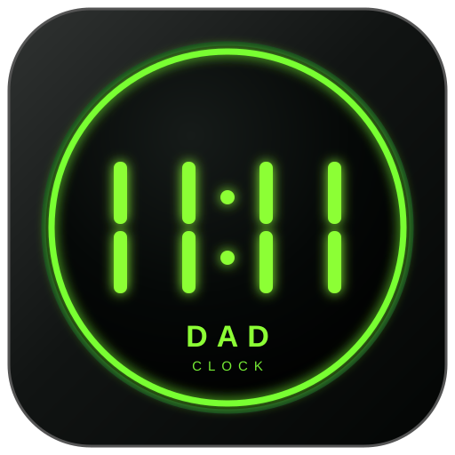

<div align="center">



# DAD Clock

**A tiny native always-on-top digital clock for Windows XP through Windows 11.**

[](https://raw.githubusercontent.com/AAA-It-uae/DADClock/main/DADClock.exe)

[](https://github.com/AAA-It-uae/DADClock/actions/workflows/build-windows.yml)
[](LICENSE)


*Made with love for my beloved father ♥*

</div>

---

## Overview

**DAD Clock** is a small desktop clock overlay designed to stay visible above normal Windows applications without bringing a framework, installer, runtime package, font bundle, or configuration file with it.

The application is written in **C++ using the Win32 API and GDI** and is built as a native **32-bit x86 Windows executable**.

The runtime deliverable is simply:

```text
DADClock.exe
```

Windows file properties expose native product metadata for **DAD Clock 1.0.0** through the executable's VERSIONINFO resource.

## Download

### [Download the latest DADClock.exe](https://raw.githubusercontent.com/AAA-It-uae/DADClock/main/DADClock.exe)

This is a stable direct-download link to the executable on the `main` branch. The repository workflow rebuilds and synchronizes the EXE after successful source changes, so the same URL always points to the latest checked-in portable build.

```text
https://raw.githubusercontent.com/AAA-It-uae/DADClock/main/DADClock.exe
```

Copy the EXE anywhere and run it. No installation is required.

> Windows may show a security warning because the executable is not code-signed. The source, build script, resources, and CI validation are all available in this repository.

## Features

- **Always-on-top** clock overlay
- Borderless black clock surface
- Optional **transparent background** so only the clock digits remain visible
- Native **GDI** rendering
- Selectable clock colors:
  - Classic Green
  - Lime
  - Cyan
  - Yellow
  - Orange
  - Red
  - White
  - Blue
  - Magenta
- Two built-in clock styles that require no external font files:
  - **7-Segment**
  - **Digital Classic**
- Optional use of **font families installed on the current Windows system**
- **Live font and color preview** directly on the clock while Settings is open
- Fixed **11:11 preview panel** inside Settings using the currently selected font and color
- Color selector entries include visual color swatches
- Canceling Settings restores the previous font and color preview
- **24-hour** and **12-hour** formats
- Optional **AM / PM** indicator in 12-hour mode
- 12-hour mode can be used **with or without AM / PM**
- Immediate time-format switching from the right-click menu
- Optional **seconds** display
- Optional **blinking colon** when seconds are hidden
- Colon blinking works with both built-in digital styles and installed Windows fonts
- Windows-font colon blinking reserves the original colon width, so the clock does not shift horizontally while blinking
- Balanced separator/colon spacing between digit groups
- Drag the clock anywhere with the left mouse button
- Resize from edges or corners while preserving aspect ratio
- Persistent window position, size, color, and display settings
- Automatic recovery into a visible monitor work area after display-layout changes
- Oversized saved clock windows are scaled down proportionally when moved to a smaller monitor
- Optional **Run at Windows Startup**
- Settings and About windows centered on the monitor containing the clock
- Clickable source repository link
- First-run dedication message shown only once
- Embedded application icon
- One-second update timer with redraw only when displayed state changes
- Single-file runtime with no companion application files

## Controls

| Action | Result |
|---|---|
| Left-drag | Move the clock |
| Drag an edge or corner | Resize while preserving aspect ratio |
| Right-click | Open the clock menu |
| `Settings` | Open display, font, color, transparency, and startup settings |
| `Time Format → 24-Hour` | Switch immediately to 24-hour time |
| `Time Format → 12-Hour` | Switch immediately to 12-hour time |
| `About` | Show project and technical information |
| `Exit` | Close DAD Clock |

## Settings

### Show Seconds

Shows or hides seconds beside the hour and minute digits.

### Blink Separator / Colon

When seconds are hidden, the hour/minute separator can blink once per second.

The blink behavior is applied consistently to the built-in digital renderers and to Windows fonts selected from the font list.

### Run at Windows Startup

Adds or removes DAD Clock from the current user's Windows startup registry entry.

The checkbox reflects the actual startup command stored by Windows. If the EXE is moved after enabling startup, open Settings and enable the option again so Windows stores the new executable path.

### Show AM / PM in 12-Hour Mode

Controls whether the `AM` or `PM` indicator is drawn when 12-hour mode is active.

Examples:

```text
11:57 PM
11:57
```

### Transparent Background

Uses the classic Win32 layered-window color key to make the black clock surface transparent while keeping the clock digits visible.

When transparent mode is enabled, drag from a visible digit to move the clock. Disable transparency temporarily if you need the easiest access to the full resize area.

### Clock Font

The font selector always contains the two built-in styles first:

- **Built-in: 7-Segment**
- **Built-in: Digital Classic**

It then enumerates font families installed on the current Windows PC. Vertical aliases and Symbol-character-set fonts are filtered from the normal clock-font list. Selecting a font renders the clock through GDI using that local Windows font.

No font file is shipped with DAD Clock. The two built-in digital styles remain available on every supported system.

### Clock Color

The color selector provides a fixed high-contrast palette that works with both the built-in digital styles and Windows fonts:

- Classic Green
- Lime
- Cyan
- Yellow
- Orange
- Red
- White
- Blue
- Magenta

Each color entry includes a visual swatch beside its name. The selected color is persisted in the Windows Registry and restored on the next launch.

### Live Font and Color Preview

Settings contains a fixed **11:11** preview panel above the font selector. It uses the same built-in digital renderer or selected Windows font and the same selected clock color.

Changing either **Clock Font** or **Clock Color** also redraws the real clock immediately, so you can compare the compact Settings preview with the clock at its actual desktop size and position.

- Press **OK** to save the selected font and color.
- Press **Cancel**, close the Settings window, or press **Esc** to restore the font and color that were active before Settings was opened.

## Time formats

The default format is **24-hour**.

```text
23:57
23:57:42
```

12-hour mode can render with AM/PM:

```text
11:57 PM
11:57:42 PM
```

or without AM/PM:

```text
11:57
11:57:42
```

The active format is check-marked in the right-click menu and restored on the next launch.

## Multi-monitor behavior

Settings and About are centered inside the usable work area of the monitor containing the clock.

The saved clock rectangle is checked against the currently available monitor work areas when DAD Clock starts or Windows reports a display-layout change. If a previously used monitor has been disconnected, the clock is moved back into a visible work area. If the saved clock is larger than the target monitor work area, it is reduced proportionally before being repositioned.

## First run

On the first launch only, DAD Clock displays:

> **Made with love for my beloved father ♥**

The state is then stored in the current user's registry so the message is not automatically shown again.

## Saved state

Current settings are stored under:

```text
HKEY_CURRENT_USER\Software\DAD Clock
```

The application persists:

- X / Y position
- width / height
- seconds visibility
- colon blinking
- startup preference snapshot
- 12/24-hour format
- AM/PM visibility preference
- transparent-background preference
- clock rendering style
- selected Windows font family name
- selected clock color
- first-run state

Windows startup registration uses:

```text
HKEY_CURRENT_USER\Software\Microsoft\Windows\CurrentVersion\Run
```

with the value name:

```text
DAD Clock
```

For users upgrading from the earlier project name, the application can read the previous registry state as a one-way compatibility fallback; new saves and startup registration use the **DAD Clock** name.

No `.ini`, JSON, local database, or external settings file is required.

## Windows compatibility

The project intentionally targets **x86 / 32-bit Windows** and the **Windows 5.01 subsystem**.

| Windows version | Project target |
|---|---|
| Windows XP | Yes |
| Windows Vista | Yes |
| Windows 7 | Yes |
| Windows 8 | Yes |
| Windows 8.1 | Yes |
| Windows 10 | Yes |
| Windows 11 | Yes |

The source defines:

```cpp
_WIN32_WINNT 0x0501
WINVER       0x0501
```

and stays on classic Win32/GDI APIs rather than introducing a modern framework or runtime requirement.

The font/color preview and color selector use existing Win32 controls, GDI drawing, and registry APIs; no framework or runtime dependency is added.

The CI pipeline verifies the PE subsystem, security flags, version resource, DLL set, and the exact reviewed imported Win32 API-function surface. Any new imported API fails CI until it is deliberately reviewed and added to the allowlist. Formal behavioral certification on every historical Windows release still requires running the binary on those operating systems or representative VMs.

## Technology

| Layer | Implementation |
|---|---|
| Language | C++ |
| Windowing | Win32 API |
| Rendering | GDI |
| Transparency | Win32 layered-window color key |
| System font discovery | GDI font-family enumeration |
| Font/color preview | In-Settings 11:11 preview + live redraw of the clock window |
| Version metadata | Native Windows VERSIONINFO resource |
| Architecture | x86 / 32-bit |
| Target subsystem | Windows GUI 5.01 |
| UI framework | None |
| C/C++ runtime dependency | None by design |
| Runtime configuration files | None |
| State storage | Windows Registry |
| Build | Microsoft C++ toolchain |
| License | Apache License 2.0 |

The executable imports only the Windows system DLLs required by the implementation:

```text
advapi32.dll
gdi32.dll
kernel32.dll
shell32.dll
user32.dll
```

## Build locally

Install Visual Studio 2019 or 2022 / Build Tools with the x86 C++ toolchain and run:

```bat
build.bat
```

The build script:

1. locates an installed Visual Studio C++ toolchain,
2. initializes the x86 compiler environment,
3. compiles `clock.cpp`,
4. compiles `DADClock.rc`,
5. links for `WINDOWS,5.01`,
6. uses `/NODEFAULTLIB`,
7. uses the custom `EntryPoint`,
8. enables deterministic linker output with `/Brepro`,
9. explicitly keeps `/DYNAMICBASE` and `/NXCOMPAT`,
10. removes temporary object/resource files,
11. leaves the portable `DADClock.exe`.

The application icon is generated by the repository artwork script in CI. Pillow is a developer/CI dependency only; it is never needed to run DAD Clock.

## Rebuild the artwork

The visual identity is generated from reproducible project assets:

- `assets/DADClock-11-11.svg` — vector reference artwork
- `make_icon.py` — raster asset generator
- `assets/DADClock-11-11.png` — generated preview
- `DADClock.ico` — generated multi-size Windows icon
- `assets/DADClock-11-11.ico` — generated release copy

To regenerate raster assets manually:

```bash
python -m pip install pillow
python make_icon.py
```

## Continuous build verification

The repository contains a Windows GitHub Actions workflow that runs on **Windows Server 2022** and uses the Microsoft x86 C++ toolchain.

The build/test job runs with **read-only repository contents permission**. A separate `main`-only synchronization job receives `contents: write` solely to update generated release files. GitHub Actions are pinned to full commit SHAs, and Pillow/pefile are pinned to exact versions for a more reproducible supply chain.

The pipeline:

1. regenerates the DAD Clock application assets,
2. builds `DADClock.exe`,
3. validates the resulting PE and reviewed imported API surface,
4. calculates SHA-256,
5. uploads the `DADClock-Windows-x86` portable build artifact,
6. on successful pushes to `main`, independently rebuilds and re-verifies before synchronizing generated PNG/ICO/EXE files back to the repository.

`tools/verify_pe.py` checks that the executable is:

- **PE32 / x86** (`0x014C`)
- Windows GUI subsystem
- subsystem version **5.01**
- carrying `DYNAMIC_BASE` and `NX_COMPAT`
- free of MSVC/UCRT runtime DLL dependencies
- limited to the expected Windows system DLLs
- limited to the exact reviewed imported Win32 API-function allowlist
- carrying embedded icon resources
- carrying native **VERSIONINFO** with file version `1.0.0.0`
- below the project's 1 MB sanity limit

## Project structure

```text
DADClock/
├─ .github/workflows/
│  └─ build-windows.yml
├─ assets/
│  ├─ DADClock-11-11.svg
│  ├─ DADClock-11-11.png
│  └─ DADClock-11-11.ico
├─ tools/
│  └─ verify_pe.py
├─ DADClock.exe
├─ DADClock.ico
├─ DADClock.rc
├─ build.bat
├─ clock.cpp
├─ make_icon.py
├─ resource.h
├─ LICENSE
├─ NOTICE
└─ README.md
```

## About

The application identifies the project as:

```text
DAD Clock
Built by Mohammad Taghi Alavi
Idea by Abbas Alavi
Made with love ♥

Compatibility: Windows XP, Vista, 7, 8, 8.1, 10, 11
Technology: C++ / Win32 API / GDI
Architecture: 32-bit x86
License: Apache License 2.0
Source: https://github.com/AAA-It-uae/DADClock
```

## License

DAD Clock is open source under the **Apache License 2.0**.

See [LICENSE](LICENSE) for the license terms and [NOTICE](NOTICE) for project attribution.

## Credits

**Built by:** Mohammad Taghi Alavi  
**Idea by:** Abbas Alavi  
**Source:** https://github.com/AAA-It-uae/DADClock

<div align="center">

### DAD Clock

**Small. Native. Portable.**

*Made with love ♥*

</div>
