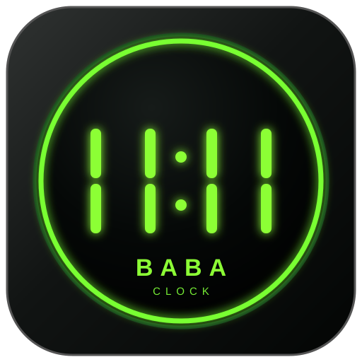

<div align="center">



# BABA Clock

**A tiny native always-on-top digital clock for Windows XP through Windows 11.**

[](https://raw.githubusercontent.com/AAA-It-uae/DADClock/main/BABAClock.exe)

[](https://github.com/AAA-It-uae/DADClock/actions/workflows/build-windows.yml)
[](LICENSE)


*Made with love for my beloved father ♥*

</div>

---

## Overview

**BABA Clock** is a small desktop clock overlay designed to stay visible above normal Windows applications without bringing a framework, installer, runtime package, font bundle, or configuration file with it.

The application is written in **C++ using the Win32 API and GDI** and is built as a native **32-bit x86 Windows executable**.

The runtime deliverable is simply:

```text
BABAClock.exe
```

The current executable is built and validated by the repository's Windows GitHub Actions workflow.

## Download

### [Download the latest BABAClock.exe](https://raw.githubusercontent.com/AAA-It-uae/DADClock/main/BABAClock.exe)

This is a **stable direct-download link** to `BABAClock.exe` on the `main` branch. The repository workflow rebuilds and synchronizes the executable after successful changes, so this same link always points to the latest checked-in portable build.

```text
https://raw.githubusercontent.com/AAA-It-uae/DADClock/main/BABAClock.exe
```

Copy the EXE anywhere and run it. No installation is required.

> Windows may show a security warning because the executable is not code-signed. The complete source, build script, resource files, and CI validation are included in this repository.

## Features

The following functionality is implemented in the current source:

- **Always-on-top** clock overlay
- Borderless black clock surface
- Optional **transparent background** so only the clock digits remain visible
- Bright green digital display
- Native **GDI** rendering
- Two clock styles that are always available without external fonts:
  - **7-Segment**
  - **Digital Classic**
- Optional use of **font families installed on the current Windows system**
- **24-hour** and **12-hour** formats
- Optional digital **AM / PM** indicator in 12-hour mode
- 12-hour mode can be used **with or without AM / PM**
- Immediate time-format switching from the right-click menu
- Optional **seconds** display
- Optional **blinking colon** when seconds are hidden
- Balanced separator/colon spacing between digit groups
- Drag the clock anywhere with the left mouse button
- Resize from edges or corners
- Fixed aspect ratio during resizing so digits do not deform
- Persistent window position and size
- Automatic recovery into a visible monitor work area after display-layout changes
- Persistent display settings
- Optional **Run at Windows Startup**
- Settings window centered on the monitor containing the clock
- About window centered on the monitor containing the clock
- Clickable source repository link
- First-run dedication message shown only once
- Embedded application icon
- One-second update timer with redraw only when displayed state changes
- Single-file runtime with no companion application files

## Controls

| Action | Result |
|---|---|
| Left-drag | Move the clock |
| Drag an edge or corner | Resize while preserving aspect ratio |
| Right-click | Open the clock menu |
| `Settings` | Open display, font, transparency, and startup settings |
| `Time Format → 24-Hour` | Switch immediately to 24-hour time |
| `Time Format → 12-Hour` | Switch immediately to 12-hour time |
| `About` | Show project and technical information |
| `Exit` | Close BABA Clock |

## Settings

### Show Seconds

Shows or hides seconds beside the hour and minute digits.

### Blink Separator / Colon

When seconds are hidden, the hour/minute separator can blink once per second.

### Run at Windows Startup

Adds or removes BABA Clock from the current user's Windows startup registry entry.

The Settings checkbox reflects the actual startup command stored by Windows. If the EXE is moved after enabling startup, open Settings and enable the option again so Windows stores the new executable path.

### Show AM / PM in 12-Hour Mode

Controls whether the `AM` or `PM` indicator is drawn when 12-hour mode is active.

This allows both forms:

```text
11:57 PM
```

and:

```text
11:57
```

while still using 12-hour clock conversion.

### Transparent Background

Uses the classic Win32 layered-window color key to make the black clock surface transparent while keeping the green digits visible.

When transparent mode is enabled, drag from a visible digit to move the clock. Disable transparency temporarily if you need the easiest access to the full resize area.

### Clock Font

The font selector contains two built-in styles first:

- **Built-in: 7-Segment**
- **Built-in: Digital Classic**

It then enumerates font families installed on the current Windows PC. Selecting one of those entries renders the clock text using that local Windows font through GDI.

No font file is shipped with BABA Clock. The two built-in digital styles remain available on every supported system even when a selected system font is not present on another PC.

## Time format

The default format is **24-hour**.

Examples:

```text
23:57
23:57:42
```

In **12-hour** mode the application can render with AM/PM:

```text
11:57 PM
11:57:42 PM
```

or without AM/PM:

```text
11:57
11:57:42
```

Only one time format is active at a time. The active format is check-marked in the right-click menu and is restored on the next launch.

## Multi-monitor behavior

Settings and About are centered inside the usable work area of the monitor that contains the clock instead of being centered relative to the clock window itself.

The saved clock rectangle is also checked against the currently available monitor work areas when the application starts or Windows reports a display-layout change. If a previously used monitor has been disconnected, BABA Clock is moved back into a visible work area.

## First run

On the first launch only, BABA Clock displays:

> **Made with love for my beloved father ♥**

The first-run state is then stored in the current user's registry so the message is not automatically shown again.

## Saved state

Application state is stored under:

```text
HKEY_CURRENT_USER\Software\BABA Clock
```

The source persists:

- X / Y position
- width / height
- seconds visibility
- colon blinking
- startup preference snapshot
- 12/24-hour format
- AM/PM visibility preference
- transparent-background preference
- clock rendering style
- selected Windows font family name
- first-run state

Windows startup registration uses:

```text
HKEY_CURRENT_USER\Software\Microsoft\Windows\CurrentVersion\Run
```

The real Windows Run entry is treated as the source of truth for the startup checkbox.

No `.ini`, JSON, local database, or external settings file is required.

## Windows compatibility

The project intentionally targets **x86 / 32-bit Windows** and the **Windows 5.01 subsystem**.

| Windows version | Project target |
|---|---|
| Windows XP | Yes |
| Windows Vista | Yes |
| Windows 7 | Yes |
| Windows 8 | Yes |
| Windows 8.1 | Yes |
| Windows 10 | Yes |
| Windows 11 | Yes |

The source defines:

```cpp
_WIN32_WINNT 0x0501
WINVER       0x0501
```

and the application remains on classic Win32/GDI APIs rather than introducing a modern framework or runtime requirement.

The CI pipeline verifies the PE subsystem and dependency contract. Formal behavioral certification on every historical Windows release still requires running the binary on those operating systems or representative VMs.

## Technology

| Layer | Implementation |
|---|---|
| Language | C++ |
| Windowing | Win32 API |
| Rendering | GDI |
| Transparency | Win32 layered-window color key |
| System font discovery | GDI font-family enumeration |
| Architecture | x86 / 32-bit |
| Target subsystem | Windows GUI 5.01 |
| UI framework | None |
| C/C++ runtime dependency | None by design |
| Runtime configuration files | None |
| State storage | Windows Registry |
| Build | Microsoft C++ toolchain |
| License | Apache License 2.0 |

The executable imports only the Windows system DLLs required by the implementation:

```text
advapi32.dll
gdi32.dll
kernel32.dll
shell32.dll
user32.dll
```

## Build locally

Install Visual Studio 2019 or 2022 / Build Tools with the x86 C++ toolchain and run:

```bat
build.bat
```

The build script:

1. locates an installed Visual Studio C++ toolchain,
2. initializes the x86 compiler environment,
3. compiles `clock.cpp`,
4. compiles `BABAClock.rc`,
5. links for `WINDOWS,5.01`,
6. uses `/NODEFAULTLIB`,
7. uses the custom `EntryPoint`,
8. removes temporary object/resource files,
9. leaves the portable `BABAClock.exe`.

The application icon is already checked in, so Pillow is **not** needed just to compile the application.

## Rebuild the artwork

The visual identity is kept reproducible instead of depending on an opaque binary design source:

- `assets/BABAClock-11-11.svg` — vector reference artwork
- `make_icon.py` — raster asset generator
- `assets/BABAClock-11-11.png` — generated preview
- `BABAClock.ico` — generated multi-size Windows icon
- `assets/BABAClock-11-11.ico` — generated release copy

To regenerate the raster assets manually:

```bash
python -m pip install pillow
python make_icon.py
```

Pillow is a **developer/CI-only** dependency. It is never required to run BABA Clock.

## Continuous build verification

The repository contains a Windows GitHub Actions workflow that runs on **Windows Server 2022** and uses the Microsoft x86 C++ toolchain.

The pipeline:

1. regenerates the 11:11 application assets,
2. builds `BABAClock.exe`,
3. validates the resulting PE,
4. calculates SHA-256,
5. uploads a portable build artifact,
6. on successful pushes to `main`, synchronizes generated PNG/ICO/EXE files back to the repository.

`tools/verify_pe.py` checks that the executable is:

- **PE32 / x86** (`0x014C`)
- Windows GUI subsystem
- subsystem version **5.01**
- free of MSVC/UCRT runtime DLL dependencies
- limited to the expected Windows system imports
- carrying an embedded icon resource
- below the project's 1 MB sanity limit

The upgraded display/settings build remains approximately **75 KB** while retaining the embedded multi-size application icon.

## Project structure

```text
DADClock/
├─ .github/workflows/
│  └─ build-windows.yml
├─ assets/
│  ├─ BABAClock-11-11.svg
│  ├─ BABAClock-11-11.png
│  └─ BABAClock-11-11.ico
├─ tools/
│  └─ verify_pe.py
├─ BABAClock.exe
├─ BABAClock.ico
├─ BABAClock.rc
├─ build.bat
├─ clock.cpp
├─ make_icon.py
├─ resource.h
├─ LICENSE
├─ NOTICE
└─ README.md
```

## About

The application identifies the project as:

```text
BABA Clock
Built by Mohammad Taghi Alavi
Idea by Abbas Alavi
Made with love ♥

Compatibility: Windows XP, Vista, 7, 8, 8.1, 10, 11
Technology: C++ / Win32 API / GDI
Architecture: 32-bit x86
License: Apache License 2.0
Source: https://github.com/AAA-It-uae/DADClock
```

## License

BABA Clock is open source under the **Apache License 2.0**.

See [LICENSE](LICENSE) for the license terms and [NOTICE](NOTICE) for project attribution.

## Credits

**Built by:** Mohammad Taghi Alavi  
**Idea by:** Abbas Alavi  
**Source:** https://github.com/AAA-It-uae/DADClock

<div align="center">

### BABA Clock

**Small. Native. Portable.**

*Made with love ♥*

</div>
